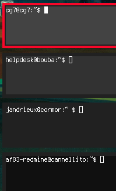

# perhostcolor

A simple shell script to change the background term colour based on the length
of the arguments ($@)

This script was originally written to facilitate visual distinction between
local and many remote shells. 

Being a [DWM](http://dwm.suckless.org) (one of many tiling window manager for
X11) who enjoys having lots of open xterminals logged to different hosts, I was
looking for a simple and hassle-free solution, very much like the nickcolor
script for irssi.

## Usage 

	perhostcolor.sh [somestring]

## How to use it with SSH

The way I primarily use this script, YMMV :

1. copy this script in your $PATH (~/bin for instance)
2. create a wrapper script for ssh :

	#!/bin/sh 
	# ~/bin/ssh
	# A wrapper for ssh
	
	# Set specific bgcolor
	perhostcolor.sh $@
	# ssh to ...
	/usr/bin/ssh $@
	# Reset to original bgcolor
	perhostcolor.sh

3. create an alias for this wrapper script (in ~/.bashrc for me)

	# ~/.bashrc 
	alias ssh="~/bin/ssh"

## Mandatory screenshot 

## Limitations 

This is a dummy script written for RXVT-Unicode (urxvt) that makes use to XTerm
escape sequence for changing the background color, as stated in the urxvt (7)
manpage.

Thus, it has not been tested thoroughly and might not work as-is on your
favourite terminal. 

# Issues ?

- contact me on IRC (freenode or oftc) as jerome or jer0me
- mail jerome at gcu.info

